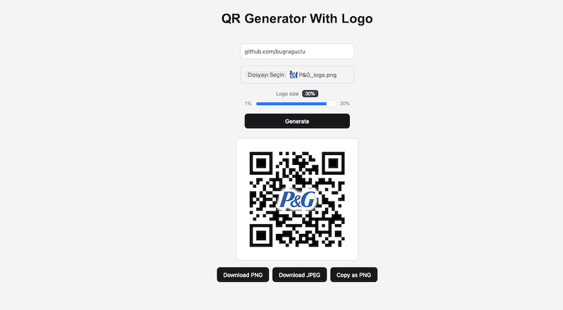

# QR Logo Generator

A browser-based tool that generates QR codes with a company logo embedded in the center. Built with vanilla JavaScript and the HTML5 Canvas API — no frameworks, no build step, no server.

**[Live demo](https://bugraguclu.github.io/qr-generator-with-logo/)**

## Examples

The white backing is generated from each logo's own alpha channel, so it follows any contour:

| Oval emblem | Irregular contour | Solid mark |
|-------------|-------------------|------------|
|  |  |  |

## Features

- Live QR generation from any URL
- Logo upload with automatic aspect-ratio preservation
- Automatic trimming of transparent/white padding around uploaded logos
- Shape-agnostic white backing with a soft glow, generated from the logo's alpha channel
- Adjustable logo size (1–30%) with a live percentage badge
- High-resolution 2000×2000 output for print quality
- Download as PNG or JPEG, or copy directly to clipboard

## How it works

1. The QR code is rendered at error-correction level **H** (~30% recovery), which keeps it scannable while the center is covered.
2. The uploaded logo is scanned pixel-by-pixel and trimmed to its visible bounds, so the size setting always refers to the actual artwork.
3. The trimmed logo is drawn onto an offscreen canvas and converted into a solid white silhouette using the `source-in` composite operation.
4. The silhouette is stamped repeatedly with a white shadow blur, building an opaque clearing that fades softly into the QR modules.
5. The original logo is drawn on top, crisp and unmodified.

## Usage

Open `index.html` in any modern browser, or use the [live demo](https://KULLANICI-ADIN.github.io/qr-logo-generator/). Enter a destination URL, upload a logo (transparent PNG recommended), adjust the size, and hit **Generate**.

## Tech

- Vanilla JavaScript (ES6)
- HTML5 Canvas API (offscreen canvas, composite operations, `getImageData` pixel scanning, shadow rendering)
- [node-qrcode](https://github.com/soldair/node-qrcode) 1.5.1 browser bundle via jsDelivr

## License

[MIT](LICENSE)
